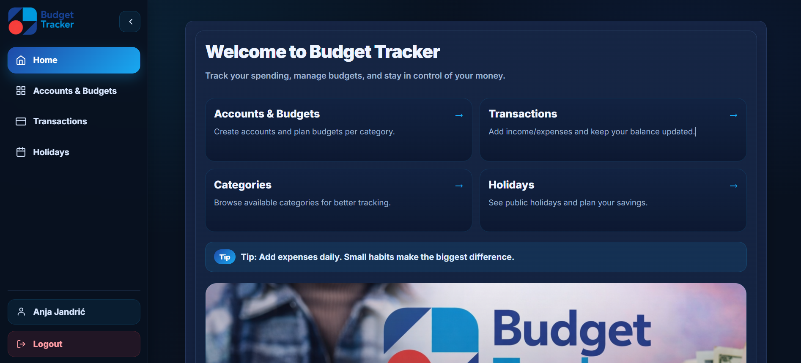
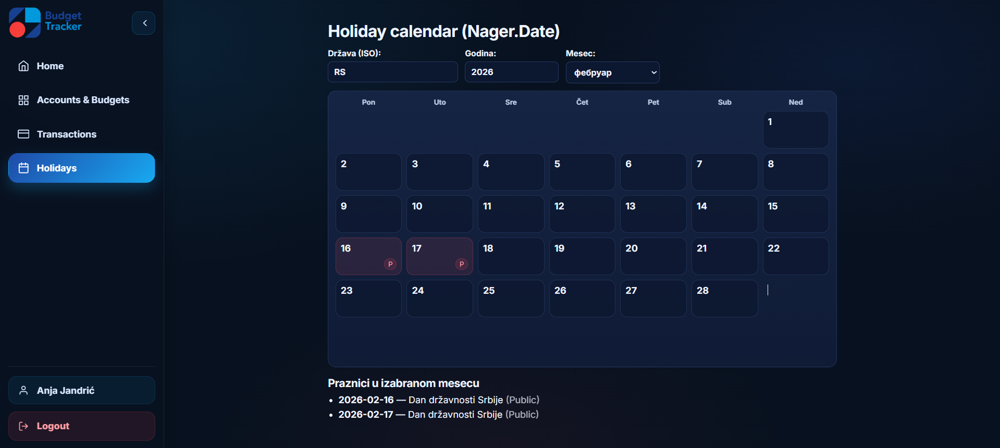
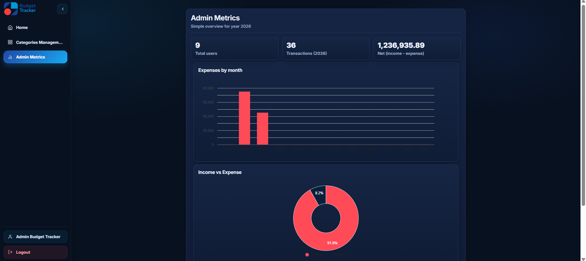

#  Budget Tracker

 Budget Tracker je web aplikacija za upravljanje ličnim finansijama i budžetom. Omogućava da na jednom mestu vodiš račune, beležiš prihode i rashode, planiraš budžete po kategorijama i pratiš potrošnju kroz vreme. Sistem dodatno nudi kalendar državnih praznika i prikaz iznosa u različitim valutama, bez menjanja izvornih vrednosti u bazi podataka.


---

## Zašto  Budget Tracker:

Većina korisnika finansije prati „u glavi“, u Excel tabelama ili ih uopšte ne prati. To često vodi prekomernoj potrošnji, slabom planiranju i izostanku štednje.  Budget Tracker rešava ovaj problem kroz centralizovan unos, pregled i analitiku, tako da je stanje uvek ažurno i lako razumljivo.

---

## Funkcionalnosti:

### Korisnik.
- Kreiranje i uređivanje finansijskih računa (npr. tekući račun, kartica, keš).
- Unos, izmena i brisanje transakcija (prihodi i rashodi).
- Planiranje mesečnih budžeta po kategorijama (npr. hrana, stanovanje, zabava).
- Praćenje potrošnje u odnosu na planirani budžet.
- Pregled lista sa filtriranjem i sortiranjem (transakcije i budžeti).
- Generisanje izveštaja o transakcijama za izabrani period i kriterijume.
- Kalendar sa obeleženim državnim praznicima radi boljeg planiranja troškova.
- „Valuta prikaza“ za pregled svih iznosa u željenoj valuti (bez promene vrednosti u bazi).


### Administrator
- Upravljanje kategorijama (kreiranje, izmena i brisanje).
- Održavanje osnovnih sistemskih podataka.

---

## Tehnologije

- Frontend: React (CRA) + JavaScript.
- Backend: Laravel (REST API, JSON) + PHP.
- Baza: MySQL.
- Lokalni razvoj: Node.js 18+, PHP 8.2+, Composer, XAMPP.
- Docker: docker-compose (frontend, backend, baza).
- Integracije: javni API za kursnu listu i javni servis za državne praznike.

---

## Brzi start

Ispod su dve opcije: lokalno (bez Dockera) i Docker. Preporuka je da koristiš Docker ako želiš što manje lokalne konfiguracije.

---

## Pokretanje lokalno (bez Dockera)

### 1) Preduslovi
- Node.js 18+.
- PHP 8.2+.
- Composer.
- XAMPP (Apache i MySQL).

### 2) Kloniranje projekta
```bash
git clone https://github.com/elab-development/internet-tehnologije-2025-budgettracker_2020_0081.git
```

### 3) Backend (Laravel)
> U XAMPP-u uključi Apache i MySQL.

```bash
cd  budgettracker-be
composer install
php artisan migrate:fresh --seed
php artisan serve
```

### 4) Frontend (React)
```bash
cd  budgettracker-fe
npm install
npm start
```

### 5) URL-ovi
- Frontend: http://localhost:3000.
- Backend API: http://127.0.0.1:8000/api.

---

## Pokretanje uz Docker

### 1) Preduslovi
- Docker Desktop instaliran i pokrenut.

### 2) Start
```bash
docker compose down -v
docker compose up --build
```

### 3) URL-ovi
- Frontend: http://localhost:3000.
- Backend API: http://127.0.0.1:8000/api.

---

## Napomene o valutama i praznicima

- Valuta prikaza služi samo za prikaz na UI. Podaci se čuvaju u originalnoj valuti računa, a preračunavanje se radi prilikom prikaza.
- Kalendar praznika koristi javni servis kako bi korisnik lakše planirao periode sa potencijalno većim troškovima.

---
